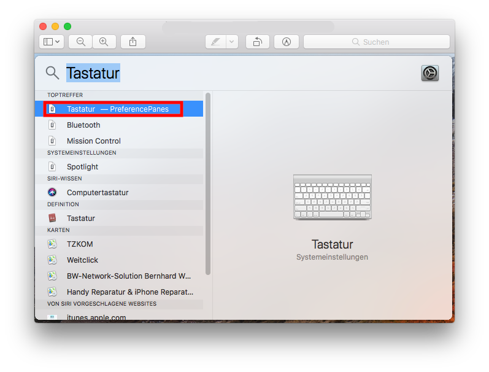
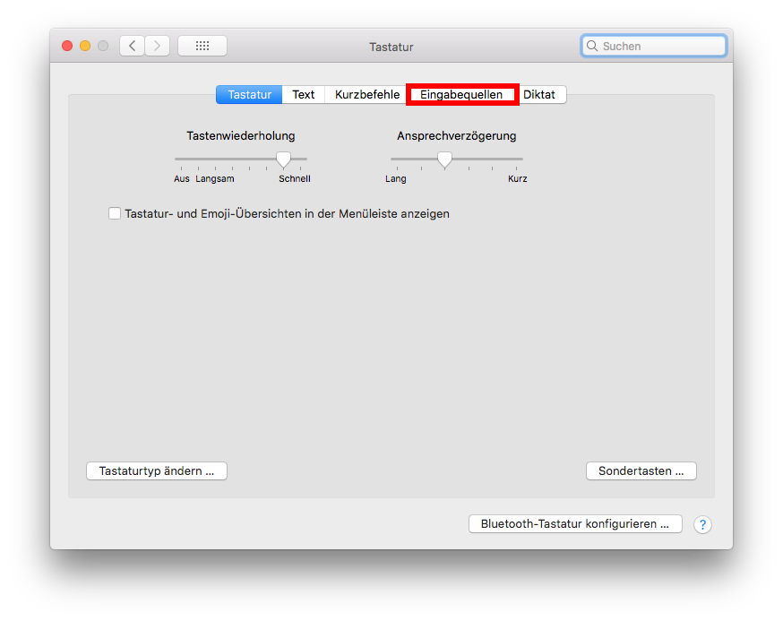
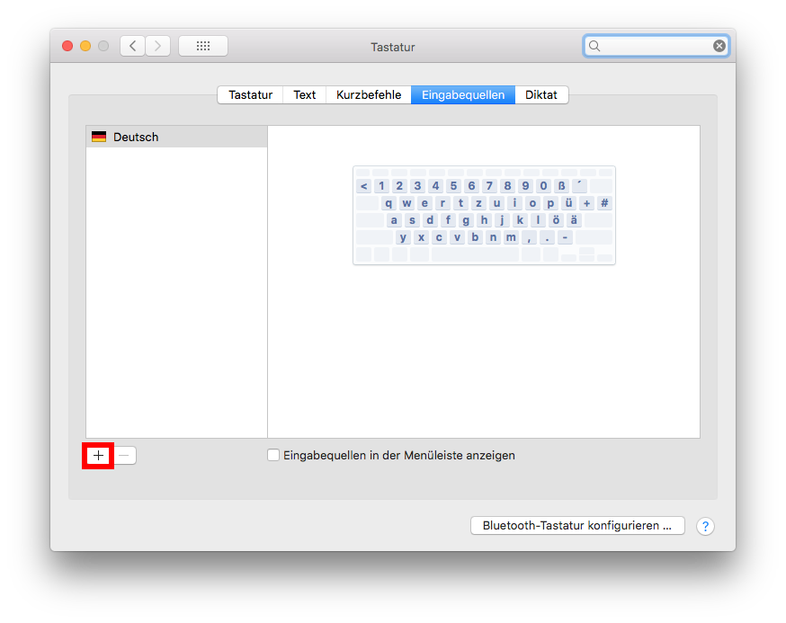
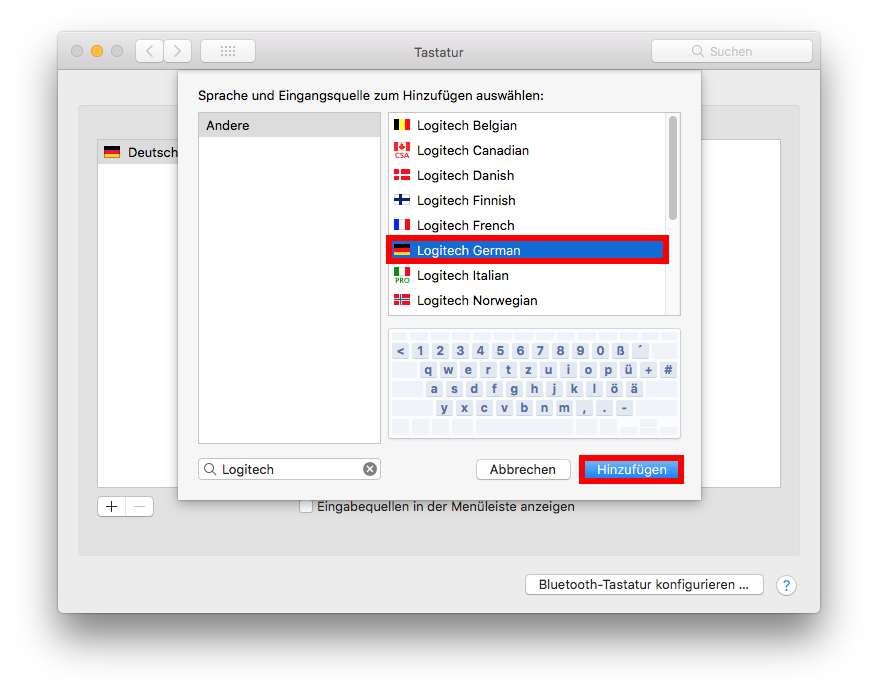
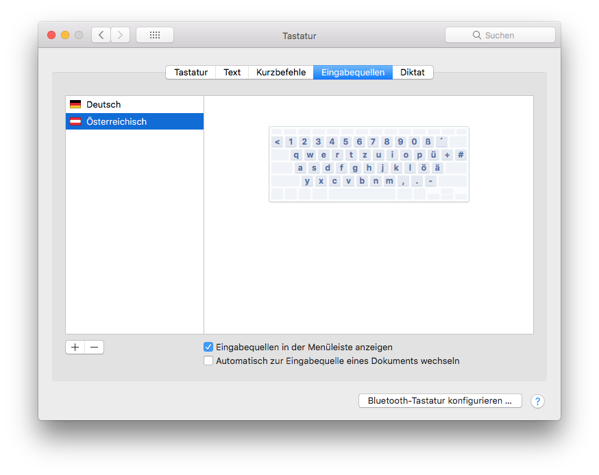
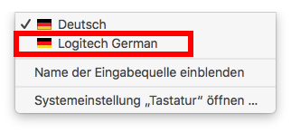

Folge diesen Schritten, um ein "normales" (nicht-Mac) Tastaturlayout zu erhalten, das der Tastenbeschriftung entspricht.

* Auf das Such-Icon in der Leiste im oberen rechten Bereich des Bildschirms klicken und in die Suchzeile "Tastatur" eingeben

  

  

* Auf den Reiter "Eingabequellen" klicken

	

* Auf das kleine "\+" klicken

	

* In die Suche den Tastaturtyp "Logitech" eingeben und das Deutsche Logitech Tastaturlaout hinzufügen

	

* Die Tastatur sollte nun neben der aktuellen Tastatur, in diesem Fall "Deutsch", angezeigt werden

	

* In der Leiste sollte nun eine Flagge aufgetaucht sein, diese anklicken

	

* Um den anderen Tastaturtyp zu verwenden, den Reiter der Logitech Tastatur anklicken.

	

