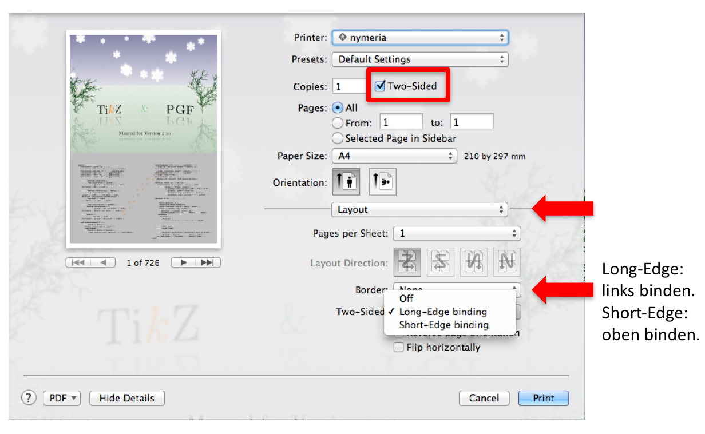
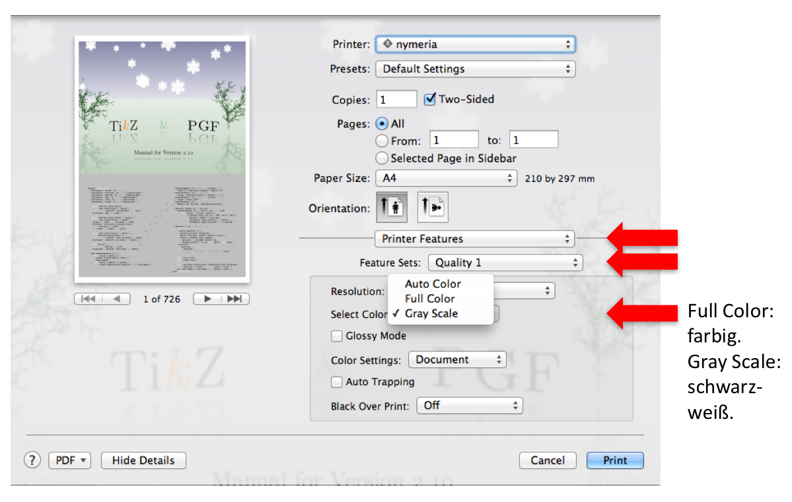
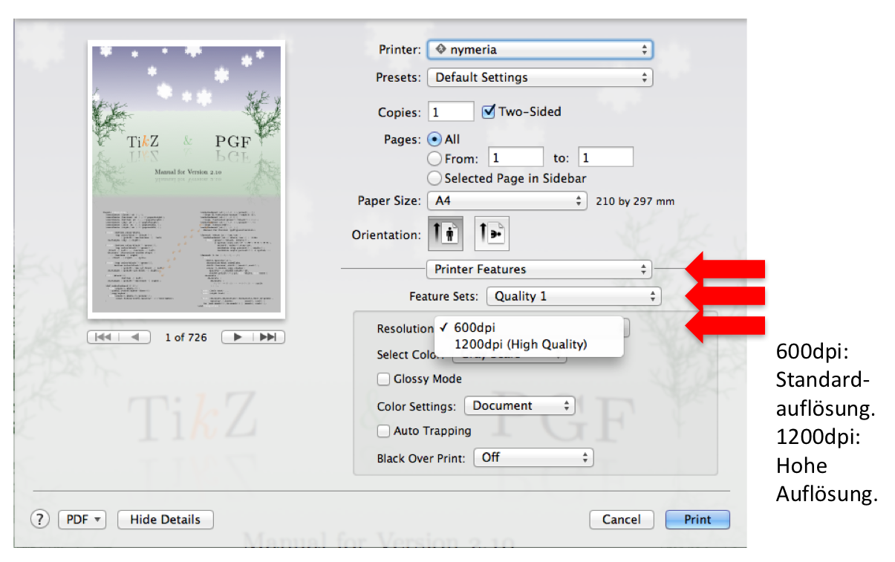
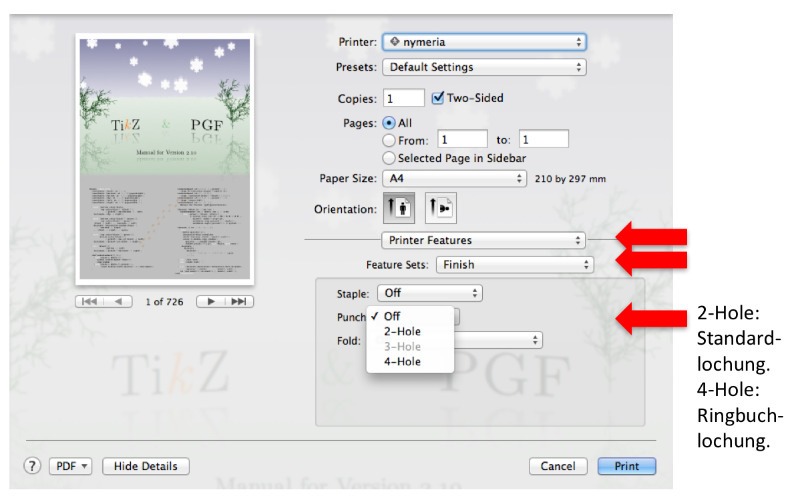
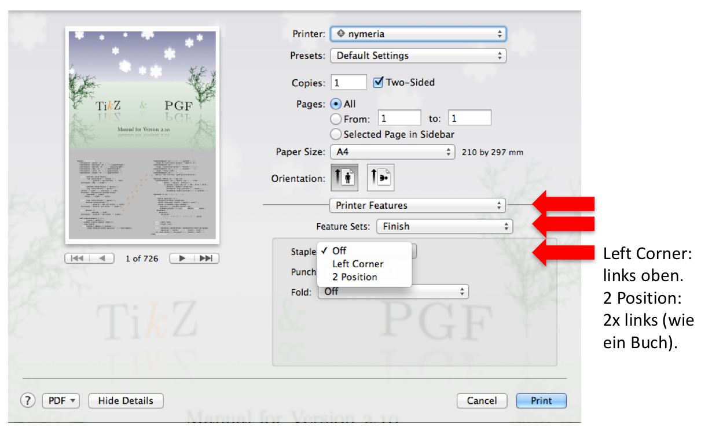
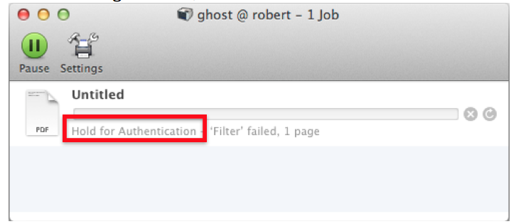

## Wie kann ich Druckeinstellungen vornehmen?

## Wie kann ich auf Vorder- und Rückseite drucken (Duplex)?

## Wie kann ich farbig oder schwarz/weiß drucken?

## Wie kann ich in besonders hoher Qualität drucken?

## Wie kann ich die gedruckten Seiten lochen?

## Wie kann ich die gedruckten Seiten zusammenheften?

## Wie merke ich, dass mein Druckkontingent aufgebraucht ist?

Diese Meldung bedeutet, dass du deine kostenlosen Druckseiten aufgebraucht hast. Bitte lösche den Druckauftrag mit dem X-Button.

## Wie funktioniert das Druckkontingent?
* Zum jedem Monatsbeginn bekommst du 100 kostenlose Seiten
* Diese Seiten können angespart werden bis zu einem maximalen Guthaben von 600 Seiten
* Seiten in Graustufendruck werden einfach abgerechnet
* Farbige Seiten werden doppelt angerechnet
* Lochen / Zusammenheften der Seiten ist gratis

Bei Problemen: E-Mail an support@physcip.uni-stuttgart.de