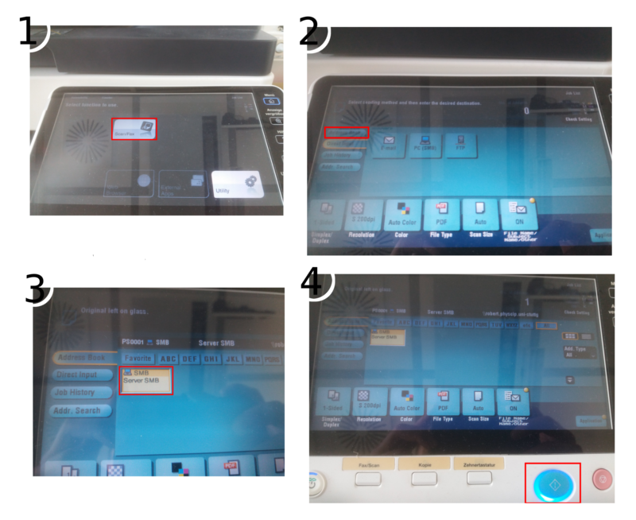

## Scannen an E-Mail

## Scannen per Samba

1. "Fax/Scannen" auswählen.
2. "Adress Book" auswählen.
3. "Server SMB" auswählen
4. Mit dem blauen Knopf den Scan bestätigen.
Die Datei befindet sich nun auf "robert" im Ordner "Scan".
