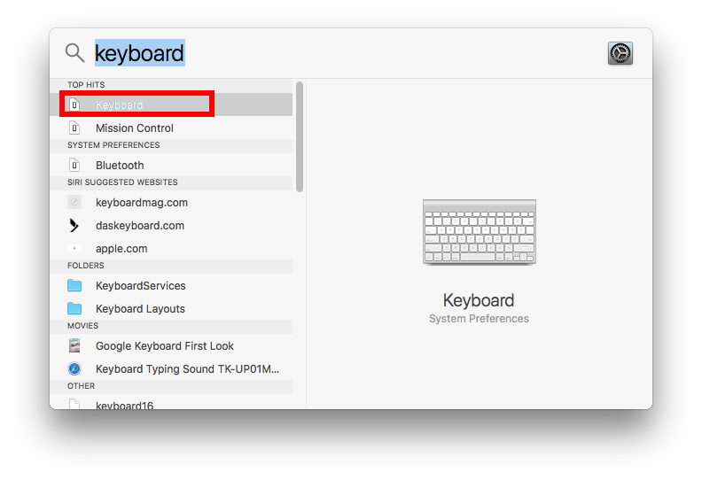
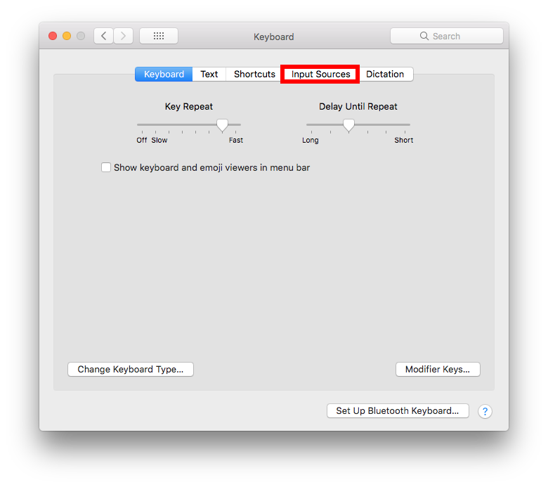
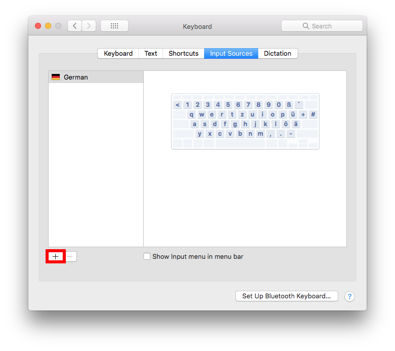
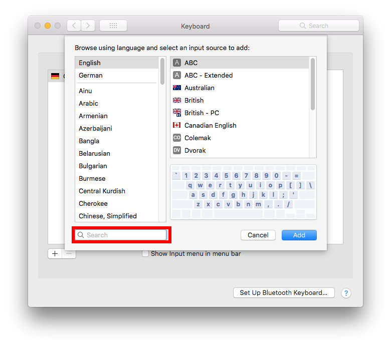
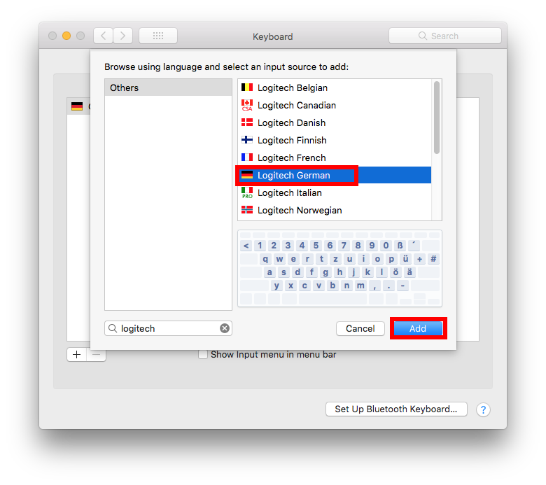
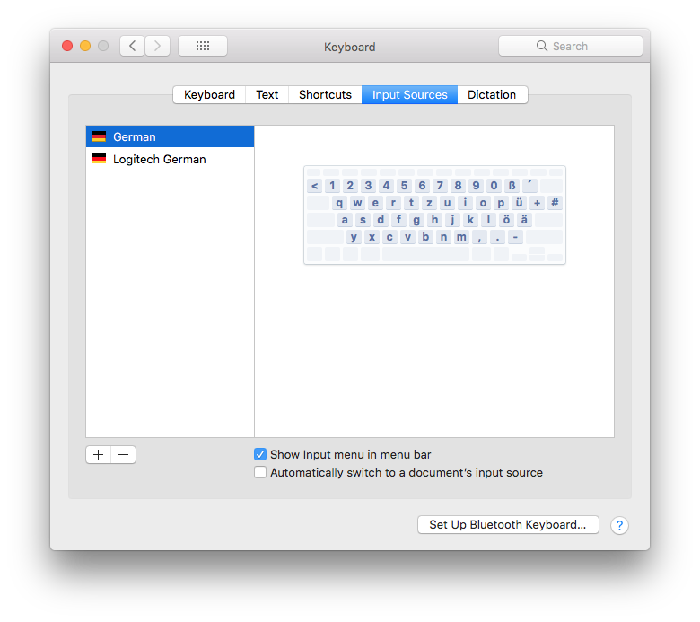
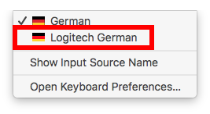

# How to change Your keyboard layout
* First click on the search icon in the upper right corner and type "keyboard" into the prompt

  

  

* Select "Input Sources"

  

* click on the "\+" sign in the left corner

  

* Type in "Logitech" and select the german version of this keyboard.

  

  

* After you added the Logitech Layout as a active keyboard layout, click the flag in the upper right corner and select the keyboard layout from the available layouts

  

  

  
