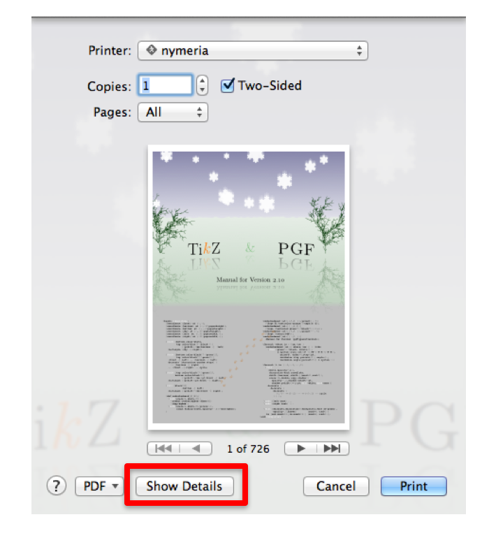
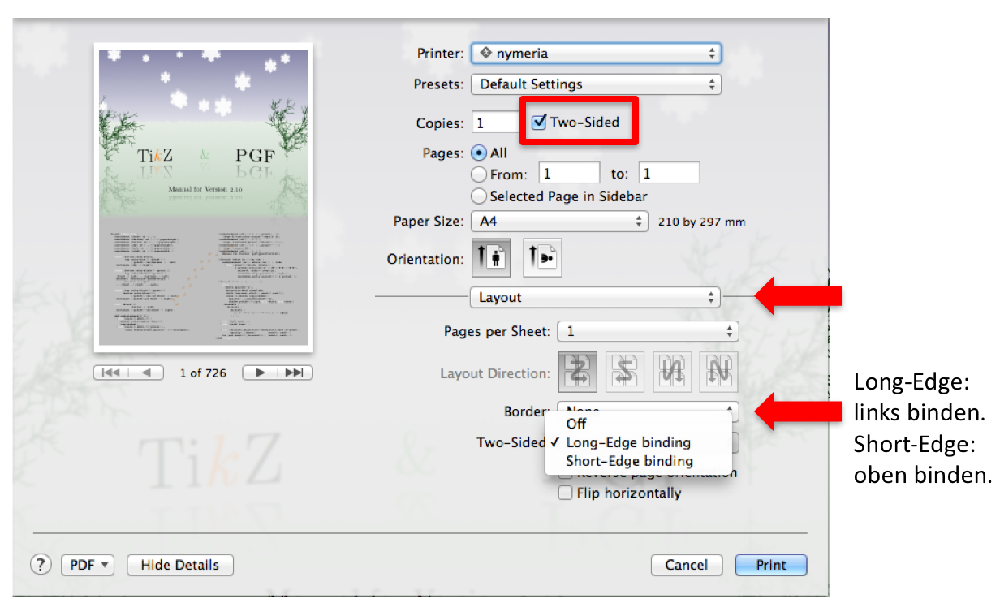
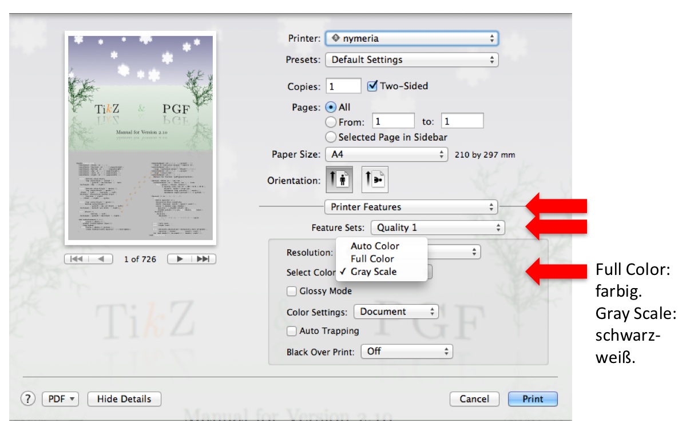
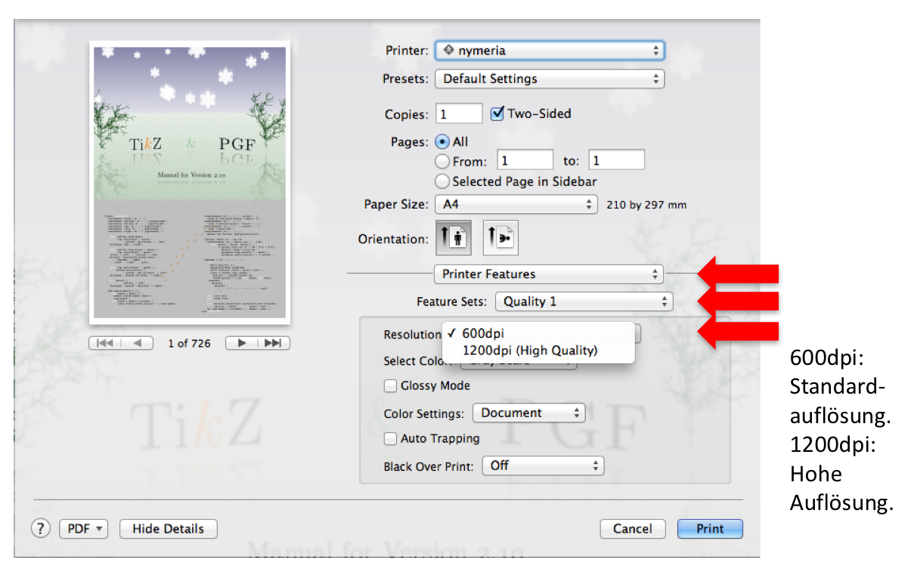
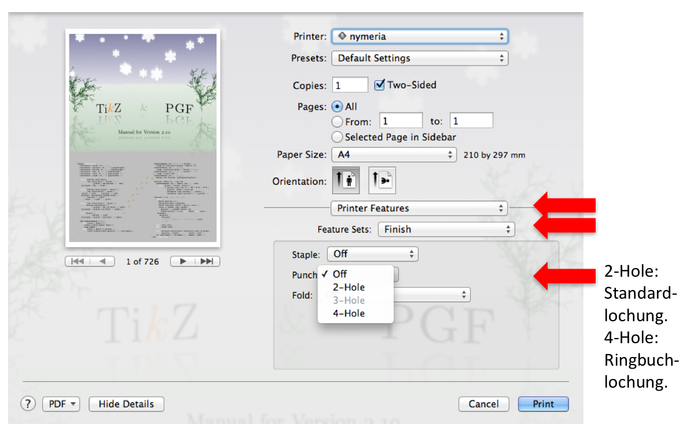
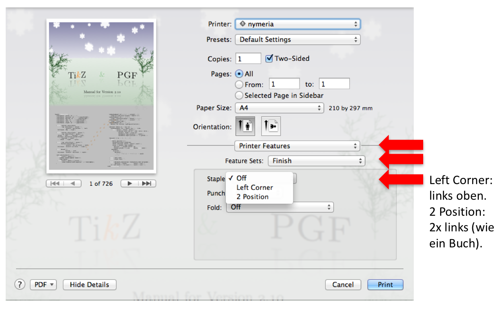
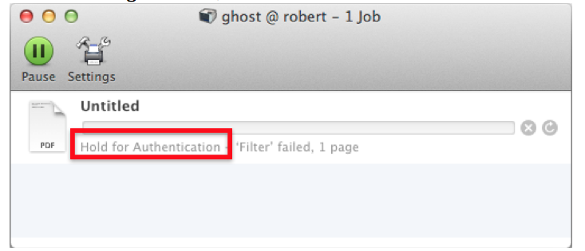

## How can I open the printer settings?

## How can I print double-sided (duplex)?

## How can I print in color / grayscale?

## How can I print in exceptionally high quality?

## How can I punch the printed pages?

## How can I stitch together the printed pages?

## How do I know that I am over my printer quota?

This error message means that you have no more pages left in your quota. Please delete the print job by clicking the X-button.

## How does the quota system work?
* You get 100 free pages at the beginning of every month
* You can save up pages up to a maximum balance of 600 pages
* Grayscale prints count onefold against your quota
* Colored prints count twofold against your quota
* Punching / stitching is free

In case you encounter any issues, feel free to contact support@physcip.uni-stuttgart.de