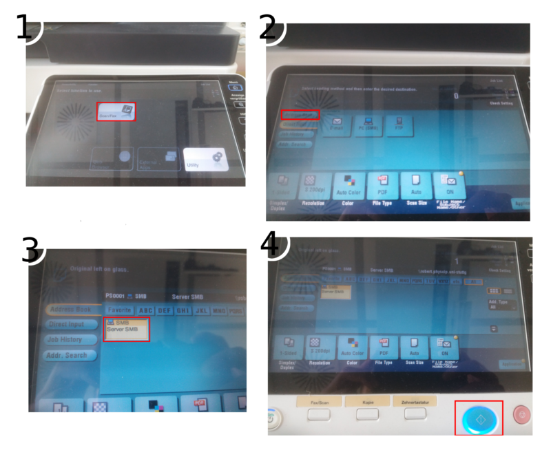

## Scan and send via email

## Scan via Samba

1. select "Scan/Fax".
2. select "Adress Book".
3. select "Server SMB"
4. confirm the scan with the blue button.
The scanned file ist now loacted on "robert" in "Scan".
