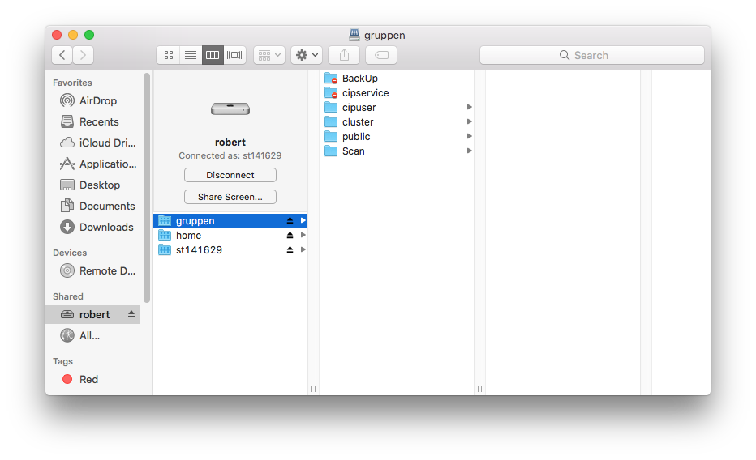

To share files with other users, click on `robert` in Finder and open the folder `gruppen`:

There you will find the following subdirectories:
* `cipuser`:  Only for students with an account in the CIP Pool are granted access, i.e. no tutors or admins
* `public`:  Open access